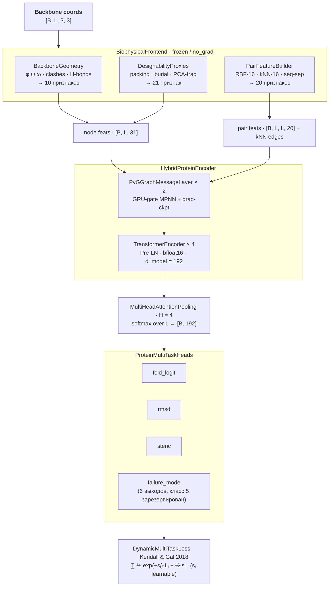

# ProteinScoreModel (BbValidator)

Пайплайн глубокого обучения для оценки **складываемости сгенерированных белковых backbone-структур**.

По сырым координатам backbone `[N, Cα, C]` модель предсказывает, сможет ли структура успешно свернуться, оценивает RMSD относительно нативной структуры, выявляет стерические конфликты и классифицирует доминирующий тип ошибки — всё за один прямой проход.

**Полная документация:** [`docs/`](docs/README.md) — обзор и постановка, биофизический фронтенд, модель и обучение, датасет, эксперименты и результаты, запуск и использование.

---

## Обзор архитектуры



Ключевые принципы:

- **Инвариантность по построению.** Все признаки фронтенда — расстояния, торсионы, секвенс-сепарации — SE(3)-инвариантны, поэтому модель инвариантна к поворотам/сдвигам без эквивариантных слоёв.
- **Честная PCA фрагментов.** `pca_proj` во фронтенде инициализируется собственными векторами попарных расстояний 9-остаточных фрагментов из нативных структур (`preprocess/fit_pca.py`) и замораживается.
- **Четыре задачи.** H-связи как отдельная auxiliary-голова убраны (решение 2026-08-09): `hbond_count` остаётся **входным признаком** (`hb_norm`), но головы и таргета для него нет.
- **failure_mode — 6 выходов, 5 классов в данных.** Класс 5 (`unknown_negative`) зарезервирован под будущие OOD-негативы (например, выходы внешних генераторов).

Во время инференса энкодер запускается `mc_runs` раз с включённым dropout для получения калиброванных оценок неопределённости (MC-Dropout).

---

## Структура репозитория

```text
.
├── train_model.py              # Обучение основной модели (селекция по (AUC+PR-AUC)/2)
├── eval_model.py               # Полная батарея метрик на сплите (JSON + markdown)
├── inference.py                # CLI-инференс PDB-файлов с MC-Dropout
├── benchmark.py                # Замеры латентности/пропускной способности
├── filter_designability.py     # Фильтр по дизайнуемости: PASS/FAIL + заваленные метрики
│
├── dataset/
│   ├── build_positive_dataset.py   # Сбор нативных структур через RCSB API
│   ├── build_negative_dataset.py   # Генерация декоев (7 стратегий деформаций)
│   ├── compute_targets.py          # Пост-расчёт steric_target (GPU)
│   ├── make_split.py               # Манифесты и сплиты по group_id (анти-утечка)
│   ├── dataloader.py               # HDF5 DataLoader, бакетизация по длине
│   ├── manifest_v1_split.csv       # source_h5 — относительные пути
│   └── *.h5                        # данные (git-ignored)
│
├── preprocess/
│   ├── biophys_frontend.py         # Оркестратор извлечения признаков
│   ├── geometry_features.py        # Торсионы, виртуальные Cβ/O, клэши, H-связи
│   ├── designability_features.py     # Упаковка, экспонированность, PCA фрагментов
│   ├── pair_features.py            # Парные признаки и kNN-граф
│   ├── fit_pca.py                  # Fit PCA по нативным структурам
│   ├── test_geometry.py            # Тесты геометрии (pytest)
│   ├── test_designability.py         # Тесты designability-признаков (pytest)
│   └── conftest.py                 # pytest-фикстуры
│
├── model/
│   ├── encoder.py                  # Гибридный граф-трансформер энкодер
│   ├── heads_loss.py               # Пулинг, головы, Dynamic Multi-Task Loss, MC-Dropout
│   └── metrics.py                  # ROC-AUC, PR-AUC, ECE (numpy/scipy)
│
├── notebooks/                  # Jupyter-тетрадки: как работает, метрики, бенчмарк
│
└── baselines/
    ├── encoders.py                 # BaselineMLPEncoder, BaselineGPSEncoder
    └── train_baseline.py           # Обучение базлайнов по тому же протоколу
```

---

## Установка

```bash
uv sync          # Python >= 3.13, зависимости из pyproject.toml
```

или вручную:

```bash
pip install torch torch-geometric biotite scipy pandas h5py tensorboard requests tqdm
```

Тесты:

```bash
pytest           # 12 тестов фронтенда (CPU, < 1 с)
```

---

## Формат данных

Датасет описывается **CSV-манифестом** со следующими обязательными колонками:

| Колонка | Тип | Описание |
|---|---|---|
| `split` | str | `train` / `val` / `test` |
| `source_h5` | str | Путь к HDF5-файлу **относительно директории манифеста** (датасет переносим) |
| `h5_group_key` | str | Ключ группы внутри HDF5-файла |
| `label` | float | 1.0 = foldable, 0.0 = decoy |

Каждая HDF5-группа должна содержать датасет `coords` формы `[L, 3, 3]` (остатки × атомы `{N, Cα, C}` × xyz), сохранённый как `float32`.

Необязательные атрибуты группы:

| Атрибут | По умолчанию | Описание |
|---|---|---|
| `rmsd_target` | 0.0 | Backbone RMSD до нативной структуры (Å) |
| `steric_target` | 0.0 | Нормализованное число стерических конфликтов |
| `failure_mode_label` | 0 | 0=Ok · 1=Easy · 2=Hard(core/compact) · 3=NearNative · 4=Borderline · 5=Unknown(резерв) |

---

## Пошаговый запуск пайплайна данных

Все команды выполняются из корня репозитория, данные кладутся в `dataset/`.

### 1. Сбор нативных белков

Композитный запрос к RCSB (X-Ray, разрешение ≤ 2.0 Å, длина 50–700 а.о.), скачивание `.cif`, извлечение backbone и проверка непрерывности пептидных связей (≤ 2.0 Å).

```bash
cd dataset && python build_positive_dataset.py && cd ..
```

Выход: `dataset/positive_proteins.h5`.

### 2. Генерация декоев

Для каждого позитивного белка — 2 декоя по взвешенной смеси стратегий (20% easy / 50% hard / 30% borderline), seed=42.

```bash
cd dataset && python build_negative_dataset.py && cd ..
```

Выход: `dataset/negative_proteins.h5`.

### 3. Расчёт стерических таргетов

`steric_target` считается отдельным проходом (GPU, идемпотентно — уже посчитанные группы пропускаются). Клэши детектируются по виртуальным Cβ (порог 3.5 Å), пары с |i−j| < 3 исключаются — это геометрия цепи, а не стерический конфликт.

```bash
cd dataset && python compute_targets.py && cd ..
```

### 4. Манифесты и сплиты

Разбиение выполняется строго по родителю (`group_id`): декой и его нативная структура всегда в одном сплите — утечка данных исключена. Пути в манифесте относительные.

```bash
cd dataset && python make_split.py && cd ..
```

Выход: `dataset/manifest_v1.csv`, `dataset/manifest_v1_split.csv`, `dataset/split_stats_v1.json`.

### 5. Fit PCA фронтенда

Точная ковариация попарных расстояний 9-остаточных фрагментов одним проходом по позитивам (без хранения всех фрагментов в памяти), топ-16 собственных векторов:

```bash
python preprocess/fit_pca.py --h5 dataset/positive_proteins.h5 --out dataset/pca_components.pth
```

`dataset/pca_components.pth` не коммитится (воспроизводится этой командой) и обязателен для обучения и инференса.

---

## Многоуровневый негативный сэмплинг (Decoy Strategies)

| Категория | Название стратегии | Биофизическая суть искажения | Класс |
|---|---|---|---|
| Positive | `positive_real` | Нативная стабильная структура из PDB | 0 |
| Easy | `easy_global_noise` | Гауссов шум высокого уровня (разрушение геометрии) | 1 |
| Easy | `easy_chain_break` | Локальный разрыв цепи со сдвигом фрагмента на 12–18 Å | 1 |
| Hard | `hard_core_unpacked` | Радиальное раздутие гидрофобного ядра (центроидное расширение) | 2 |
| Hard | `hard_false_compact` | Разрез на блоки, случайная ротация и хаотичная упаковка | 2 |
| Hard | `hard_near_native` | Анизотропное масштабирование вдоль осей и микро-повороты | 3 |
| Borderline | `borderline_hinge_defect` | Шарнирный излом хвоста структуры относительно случайного шарнира | 4 |
| Borderline | `borderline_local_fragment_rotation` | Скручивание фрагмента (3–9 остатков) вдоль внутренней оси цепи | 4 |

---

## Функция потерь: Homoscedastic Task Uncertainty

Модель оптимизирует гетерогенные задачи (бинарная классификация, регрессия в логарифмических шкалах и многоклассовое разделение), поэтому веса лоссов обучаются автоматически по Kendall & Gal (2018):

$$L = \sum_i \left[ \frac{L_i}{2\sigma_i^2} + \log \sigma_i \right] = \sum_i \left[ \tfrac{1}{2} e^{-s_i} L_i + \tfrac{1}{2} s_i \right]$$

Для `failure_mode` дополнительно используются веса классов по обратной частоте train-сплита (компенсация дисбаланса).

---

## Обучение

```bash
python train_model.py
```

| Параметр | Значение | Описание |
|---|---|---|
| `seed` | 42 | torch/numpy/random, сэмплер и worker'ы |
| `d_model` | 192 | Размер скрытого пространства энкодера |
| `num_graph_layers` | 2 | MPNN-слои (GRU-gate, gradient checkpointing) |
| `num_transformer_layers` | 4 | Pre-LN Transformer |
| `num_heads` | 8 | Attention-heads энкодера |
| `dropout` | 0.15 | Encoder + heads |
| `batch_size` | 16 | Бакеты по длине (ширина 50) — минимум паддинг-отходов |
| `num_epochs` | 15 | Cosine annealing |
| `lr` (model) | 3e-4 | AdamW, weight decay 1e-4 |
| `lr` (loss) | 1e-3 | Отдельная param-group для log-variance лосса |

Обучение использует **bfloat16 automatic mixed precision**. Лучший чекпоинт выбирается по составной метрике **(Val ROC-AUC + Val PR-AUC) / 2** (порог-независимая, устойчива к дисбалансу классов 1:2) и сохраняется в `checkpoints/best_model.pth`; `checkpoints/last_model.pth` пишется всегда. Логи TensorBoard — `runs/ProteinScoreModel`.

```bash
tensorboard --logdir runs/
```

---

## Базлайны

Для сравнения архитектур в `baselines/` обучаются две модели **по тому же протоколу** (тот же фронтенд с PCA, пулинг, головы, лосс, сиды и селекция) — отличается только энкодер (d_model=128):

```bash
python baselines/train_baseline.py --encoder mlp   # MLP на остаток, без обмена между позициями
python baselines/train_baseline.py --encoder gps   # GPSConv (TransformerConv + глобальное внимание)
```

Чекпоинты: `checkpoints/baseline_{mlp,gps}_{best,last}.pth`, логи: `runs/Baseline_{MLP,GPS}`.

---

## Оценка

```bash
python eval_model.py -c checkpoints/best_model.pth --split test -o eval_results.json
```

Батарея метрик на test-сплите:

- **fold-задача:** Accuracy, ROC-AUC, PR-AUC, ECE (калибровка), precision/recall;
- **per-strategy:** recall на нативах; specificity и ROC-AUC «нативы против семейства декоев» для каждой стратегии;
- **failure_mode:** confusion matrix 6×6 и accuracy;
- **auxiliary:** MSE голов RMSD (log1p) и steric.

Результаты пишутся в JSON и печатаются markdown-таблицей.

---

## API инференса

### Командная строка

```bash
# Один PDB-файл
python inference.py -i path/to/structure.pdb -c checkpoints/best_model.pth

# Каталог с PDB-файлами
python inference.py -i path/to/pdb_dir/ -c checkpoints/best_model.pth

# Принудительно использовать CPU и увеличить число проходов MC-Dropout
python inference.py -i structure.pdb --cpu -m 32
```

Выходные колонки:

| Колонка | Описание |
|---|---|
| `P(Fold)` | Средняя вероятность успешного сворачивания (0–1) |
| `Uncert.` | Дисперсия по проходам MC-Dropout (эпистемическая неопределённость) |
| `Pred RMSD` | Предсказанный backbone RMSD до нативной структуры (Å) |
| `Len` | Длина последовательности (число остатков) |

Визуальный индикатор: ✅ `P > 0.8` · ⚠️ `P > 0.4` · ❌ `P ≤ 0.4`

### Фильтр по дизайнуемости

`filter_designability.py` батчево скорит каталог структур и для каждой печатает вердикт и конкретные заваленные метрики. Обязательный гейт — `--min-pfold`; опциональные — `--max-steric`, `--max-clashes` (сырые конфликты Cβ < 3.5 Å), `--max-rmsd`, `--max-uncertainty`:

```bash
python filter_designability.py -i data/ood/evodiff/scaffolds --min-pfold 0.5 --max-clashes 2 -o evodiff_filter.csv
```

```
Файл           |   L | P(fold) |      u | p_стер |  RMSD | конфл | H-св | failure_mode  | вердикт
14_5IUS_16.pdb | 142 |   0.000 | 0.0000 |  0.516 | 21.75 |     4 |   27 | easy(0.92)    | FAIL: pfold 0.000 < 0.50; конфликты 4 > 2
22_1BCF_07.pdb | 157 |   0.918 | 0.0001 |  0.500 |  0.05 |     0 |  233 | ok(0.88)      | PASS
```

Полный CSV со всеми метриками (P(fold), MC-дисперсия, стерика, RMSD, failure mode, конфликты, H-связи) сохраняется в `-o`.

### Интерактивные тетрадки

`notebooks/` запускаются прямо в репозитории (`uv run jupyter lab`, jupyterlab — dev-зависимость):

| Тетрадка | Содержание |
|---|---|
| `01-kak-rabotaet.ipynb` | проход пайплайна по шагам: фронтенд, головы, MC-Dropout, скоринг образцов |
| `02-metriki-i-primery.ipynb` | метрики на test, распределения P(fold) по генераторам, лучшие/худшие примеры |
| `03-benchmark.ipynb` | живые замеры латентности против $M$ и длины |

Бенчмарк скорости:

```bash
python benchmark.py -i data/3MYC.pdb -c checkpoints/best_model.pth -m 16 -n 50
```

Результаты замеров (RTX 3080, bf16-автокаст, `best_model.pth`, B=1, 5 прогревочных + 50 замеров):

| Длина, ост. | M | Латентность, мс | p90, мс | Пропускная способность, цепей/с |
|---:|---:|---:|---:|---:|
| 64  | 8  | 16.8 | 17.1 | 59 |
| 64  | 16 | 31.6 | 32.1 | 32 |
| 64  | 32 | 60.8 | 61.5 | 16 |
| 134 | 8  | 17.4 | 17.8 | 57 |
| 134 | 16 | 33.9 | 34.2 | 30 |
| 134 | 32 | 63.0 | 63.2 | 16 |
| 242 | 8  | 17.8 | 18.2 | 56 |
| 242 | 16 | 33.2 | 33.4 | 30 |
| 242 | 32 | 64.7 | 65.3 | 15 |

Стоимость складывается из одноразового фронтенда (~2 мс) и $M$ проходов энкодера (~1.9 мс/проход), поэтому латентность линейна по $M$ и слабо зависит от длины в диапазоне 64–242 остатка.

> Чекпоинты, обученные до пересборки 2026-08, несовместимы с текущей архитектурой
> (убрана hbond-голова, добавлен PCA-буфер) — `inference.py` сообщит об этом явно.
