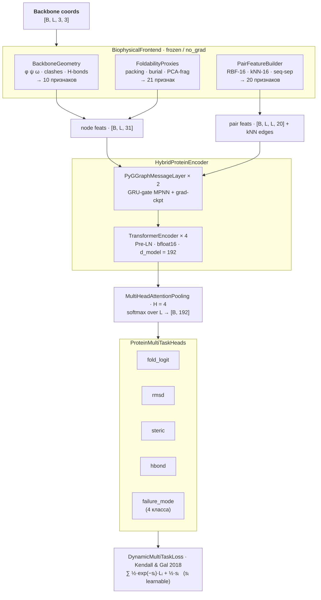

# ProteinScoreModel

Пайплайн глубокого обучения для оценки **складываемости сгенерированных белковых backbone-структур**.

По сырым координатам backbone `[N, Cα, C]` модель предсказывает, сможет ли структура успешно свернуться, оценивает RMSD относительно нативной структуры, выявляет стерические конфликты и паттерны водородных связей, а также классифицирует доминирующий тип ошибки — всё за один прямой проход.

---

## Обзор архитектуры



Фронтенд вычисляет физически осмысленные признаки **один раз** и кеширует их.
Во время инференса энкодер запускается `mc_runs` раз с включённым dropout для получения калиброванных оценок неопределённости (MC-Dropout).

---

## Структура репозитория

```text
.
├── build_positive_dataset.py   # Сбор нативных структур через RCSB API
├── build_negative_dataset.py   # Генерация декоев (7 стратегий деформаций)
├── compute_targets.py          # Изолированный пост-расчёт физических таргетов
├── make_split.py               # Группировка манифеста и валидация утечек
├── dataloader.py               # Оптимизированный HDF5 DataLoader с SE(3)-аугментацией
│
├── preprocess/
│   └── __init__.py
│
├── model/
│   ├── biophys_frontend.py     # Оркестратор извлечения признаков
│   ├── geometry_features.py    # Вычисление диэдральных углов и виртуальных атомов
│   ├── foldability_features.py # Плотность упаковки, экспонированность, PCA фрагментов
│   ├── pair_features.py        # Построение парных признаков и RBF-расстояний
│   └── encoder.py              # Гибридный граф-трансформер энкодер
│
└── loss/
    └── heads_loss.py           # Головы, пулинг, Dynamic Multi-Task Loss, MC-Dropout
```

---

## Установка

```bash
pip install torch torchvision torch-geometric biotite scipy pandas h5py tensorboard
```
---

## Формат данных

Датасет описывается **CSV-манифестом** со следующими обязательными колонками:

| Колонка | Тип | Описание |
|---|---|---|
| `split` | str | `train` / `val` / `test` |
| `source_h5` | str | Путь к HDF5-файлу, содержащему данный сэмпл |
| `h5_group_key` | str | Ключ группы внутри HDF5-файла |
| `label` | float | 1.0 = foldable, 0.0 = decoy |

Каждая HDF5-группа должна содержать датасет `coords` формы `[L, 3, 3]` (остатки × атомы `{N, Cα, C}` × xyz), сохранённый как `float32`.

Необязательные атрибуты группы:

| Атрибут | По умолчанию | Описание |
|---|---|---|
| `rmsd_target` | 0.0 | Backbone RMSD до нативной структуры (Å) |
| `steric_target` | 0.0 | Нормализованное число стерических конфликтов |
| `hbond_target` | 0.0 | Нормализованное число водородных связей |
| `failure_mode_label` | 0 | 0=Ok · 1=Clash · 2=Core · 3=Loop |

---

## Пошаговый запуск пайплайна данных

Для подготовки сбалансированного датасета выполните последовательно следующие модули.

### 1. Сбор нативных белков

Скрипт формирует композитный запрос к RCSB, скачивает валидные `.cif`-файлы, извлекает backbone (`N`, `Cα`, `C`) и проверяет непрерывность пептидных связей (`≤ 2.0 Å`).

```bash
python build_positive_dataset.py
```

- **Вход:** запрос к RCSB API (фильтры: X-Ray, разрешение `≤ 2.0 Å`, длина `50–700` а.о.).
- **Выход:** `positive_proteins.h5`

### 2. Генерация декоев (негативный сэмплинг)

Для каждого позитивного белка генерируется `N` искусственных структур-ловушек с разным уровнем критичности дефектов.

```bash
python build_negative_dataset.py
```

- **Выход:** `negative_proteins.h5` (содержит метаданные применённой стратегии деформации)

### 3. Автономный расчёт биофизических таргетов

Выделенный шаг, рассчитывающий точные значения стерических столкновений и водородных связей с помощью GPU-векторизации.
Вынос этого шага из основного загрузчика данных экономит до 40% времени эпохи обучения.

```bash
python compute_targets.py
```

- **Модифицирует файлы:** `positive_proteins.h5` и `negative_proteins.h5`

### 4. Создание манифестов и разбиение на сплиты

Формирует финальные таблицы и распределяет белки по выборкам `train`, `val` и `test`.
Разбиение выполняется строго по PDB ID (`group_id`), что гарантирует: декой и его нативный родитель всегда находятся в одном сплите, исключая data leakage.

```bash
python make_split.py
```

- **Выход:** `manifest_v1.csv`, `manifest_v1_split.csv`, `split_stats_v1.json`

---

## Многоуровневый негативный сэмплинг (Decoy Strategies)

Модель обучается распознавать дефекты различной степени выраженности благодаря диверсифицированной генерации:

| Категория | Название стратегии | Биофизическая суть искажения | Метка класса |
|---|---|---|---|
| Positive | `positive_real` | Нативная стабильная структура из PDB | 0 |
| Easy | `easy_global_noise` | Гауссов шум высокого уровня (разрушение геометрии) | 1 |
| Easy | `easy_chain_break` | Локальный разрыв цепи со сдвигом фрагмента на 12–18 Å | 1 |
| Hard | `hard_core_unpacked` | Радиальное раздутие гидрофобного ядра (центроидное расширение) | 2 |
| Hard | `hard_false_compact` | Разрез на блоки, случайная ротация и хаотичная упаковка | 2 |
| Hard | `hard_near_native` | Анизотропное масштабирование вдоль осей и микро-повороты | 3 |
| Borderline | `borderline_hinge_defect` | Шарнирный излом хвоста структуры относительно случайного шарнира | 4 |
| Borderline | `borderline_local_fragment_rotation` | Скручивание фрагмента (3–9 остатков) вдоль внутренней оси цепи | 4 |

---

## Функция потерь: Homoscedastic Task Uncertainty

Поскольку модель оптимизирует гетерогенные задачи (бинарная классификация, регрессия углов/расстояний в логарифмических шкалах и многоклассовое разделение), ручной подбор весов лоссов неэффективен.
Реализован адаптивный лосс по методу Kendall & Gal (2018)

---

## Обучение

```bash
python train_model.py
```

Ключевые гиперпараметры задаются внутри `main()`:

| Параметр | Значение по умолчанию | Описание |
|---|---|---|
| `d_model` | 192 | Размер скрытого пространства энкодера |
| `num_graph_layers` | 2 | Число MPNN-слоёв |
| `num_transformer_layers` | 4 | Число слоёв Transformer encoder |
| `num_heads` | 8 | Число attention-heads |
| `dropout` | 0.15 | Вероятность dropout (encoder + heads) |
| `batch_size` | 16 | Число сэмплов в батче |
| `num_epochs` | 15 | Число эпох обучения |
| `lr` (model) | 3e-4 | Learning rate AdamW для весов модели |
| `lr` (loss) | 1e-3 | Learning rate AdamW для весов task uncertainty |

Обучение использует **bfloat16 automatic mixed precision** и **gradient checkpointing** внутри MPNN-слоёв.
Лучший чекпоинт (по validation accuracy) сохраняется в `checkpoints/best_model.pth`.
Логи TensorBoard пишутся в `runs/ProteinScoreModel`.

```bash
tensorboard --logdir runs/
```

---

## API инференса

### Командная строка

```bash
# Один PDB-файл
python inference.py -i path/to/structure.pdb -c checkpoints/best_model.pth

# Каталог с PDB-файлами
python inference.py -i path/to/pdb_dir/ -c checkpoints/best_model.pth

# Принудительно использовать CPU и увеличить число проходов MC-Dropout
python inference.py -i structure.pdb --cpu -m 32
```

Выходные колонки:

| Колонка | Описание |
|---|---|
| `P(Fold)` | Средняя вероятность успешного сворачивания (0–1) |
| `Uncert.` | Дисперсия по проходам MC-Dropout (эпистемическая неопределённость) |
| `Pred RMSD` | Предсказанный backbone RMSD до нативной структуры (Å) |
| `Len` | Длина последовательности (число остатков) |

Визуальный индикатор: ✅ `P > 0.8` · ⚠️ `P > 0.4` · ❌ `P ≤ 0.4`

---

---
