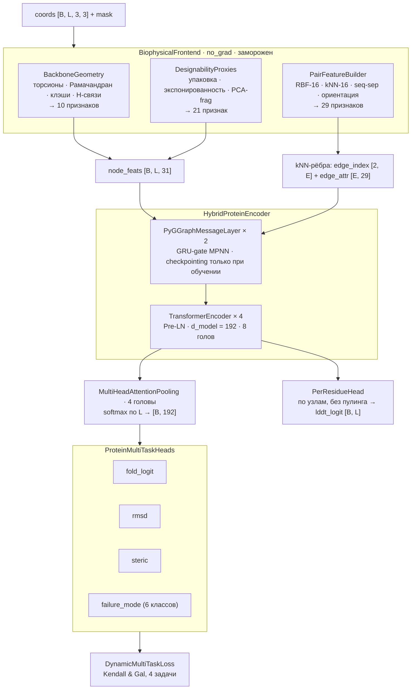

# 03 — Модель и обучение

## 3.1 Архитектура

## 3.2 Гибридный энкодер

Идея гибридизации: локальные контакты и глобальный контекст обрабатываются специализированными механизмами.

**MPNN на kNN-графе (2 слоя).** Каждый остаток обменивается сообщениями с 16 пространственными соседями. Сообщение — функция признаков узла-источника и парных признаков ребра (29-мерных); обновление узла через GRU-гейт (сигналы «забыть/обновить» контролируют, какую долю старой информации сохранить). Упаковка графа сводится к `x[mask]`: фронтенд выдаёт рёбра сразу в упакованной нумерации всего батча, поэтому сшивать графы циклом с пересчётом смещений не нужно (модуль 02, 2.7). Для экономии памяти MPNN-слои обёрнуты в **gradient checkpointing** (`use_reentrant=False`) — **только на обучении**: на инференсе он ничего не экономит, а обёртка стоит времени.

**Transformer Encoder (4 слоя, Pre-LN).** Обрабатывает последовательность целиком и ловит дальнодействующие корреляции, недоступные локальному графу. `src_key_padding_mask` исключает паддинг; обучение в bf16 (см. 3.6).

## 3.3 Пулинг и головы

**MultiHeadAttentionPooling (4 головы):** обучаемые запрос-векторы attended-пулинга собирают взвешенную сумму по остаткам (softmax с маскированием паддинга $-\!10^9$), затем головы конкатенируются и проецируются в $d_{model}$. Даёт представление всей структуры $[B, d_{model}]$.

**ProteinMultiTaskHeads:** четыре независимых MLP-головы (fold → 1 логит, rmsd → 1, steric → 1, failure_mode → 6). Класс 5 (`unknown_negative`) в данных отсутствует — выход зарезервирован под будущие OOD-негативы.

**PerResidueHead** (опциональна, добавлена 2026-08) работает **не по пулингу, а по узловым представлениям**, поэтому выдаёт вектор длины $L$ вместо скаляра: `lddt_logit [B, L]`. Таргет — CA-lDDT остова против ESMFold-рефолда его же дизайненной последовательности. Смысл — «воспроизводится ли локальное окружение остатка $i$, когда последовательность реально сворачивают». Чекпоинты без этой головы грузятся как раньше: она инициализируется с нуля (`build_model(..., per_residue=True)`).

## 3.4 Функция потерь: гомоскедастическая неопределённость

Четыре задачи разной природы (классификация + регрессии в разных шкалах) нельзя суммировать с ручными весами. Используется подход Kendall et al. (2018): каждая задача получает обучаемый log-варианс $s_t = \ln \sigma_t^2$:

$$\mathcal{L}_{total} = \sum_{t=1}^{4} \left( \tfrac{1}{2} e^{-s_t} \mathcal{L}_t + \tfrac{1}{2} s_t \right)$$

Второе слагаемое штрафует завышение дисперсии и не даёт лоссу уйти в $-\infty$. Задачи:

| Лосс | Формула |
|---|---|
| fold | $\operatorname{BCEWithLogits}(\hat{y}_{fold}, y_{label})$ |
| rmsd | $\operatorname{MSE}(\hat{y}_{rmsd}, \ln(1 + y_{rmsd}))$ — log1p стабилизирует хвост разрушенных структур |
| steric | $\operatorname{MSE}(\hat{y}_{steric}, y_{steric})$ |
| failure_mode | $\operatorname{CrossEntropy}(\hat{y}_{fm}, y_{fm}, \text{weight}=W_{classes})$ |

Для failure_mode передаются **веса классов по обратной частоте** train-сплита (компенсация дисбаланса; класс 5 имеет нулевой вес, т.к. в данных отсутствует). Параметры $s_t$ оптимизируются отдельной param-group с LR $10^{-3}$.

## 3.5 MC-Dropout инференс

Эпистемическая неопределённость оценивается многократным прогоном с включённым дропаутом (Gal & Ghahramani, 2016):

1. фронтенд вычисляет физические признаки **строго один раз** (`no_grad`);
2. у всех `nn.Dropout`-модулей энкодера и голов временно включается режим `train`;
3. $M$ проходов (по умолчанию 8): собирается $\{\sigma(\text{logit}_m)\}$;
4. выход: $\bar{p} = \operatorname{mean}$, $U = \operatorname{var}$;
5. флаги модулей восстанавливаются.

Поскольку каждый MC-проход гоняет только энкодер (физика уже посчитана), инференс остаётся дешёвым — см. бенчмарк в модуле 06.

## 3.6 Протокол обучения

| Параметр | Значение | Комментарий |
|---|---|---|
| $d_{model}$ | 192 | у базлайнов 128 |
| MPNN-слои / Transformer-слои | 2 / 4 | Pre-LN, 8 голов |
| Dropout | 0.15 | энкодер и головы |
| Batch size | 64 | **бакеты по длине** (шаг 50) — минимум паддинг-отходов при $L \in [50, 700]$ |
| Эпохи | 15 | cosine annealing |
| LR (модель) | $6 \times 10^{-4}$ | AdamW, weight decay $10^{-4}$; sqrt-скейлинг от базового $3 \times 10^{-4}$ при переходе batch 16 → 64 |
| LR (параметры лосса $s_t$) | $10^{-3}$ | отдельная param-group |
| Сид | 42 | torch/numpy/random + сид сэмплера и worker'ов DataLoader |
| Селекция чекпоинта | $(\mathrm{AUC} + \mathrm{PR\text{-}AUC})/2$ на val | порог-независимая метрика, устойчива к дисбалансу 1:2 |
| Чекпоинты | `best_model.pth` + `last_model.pth` | в чекпоинте: веса, конфиг, сид |

Точность: **bfloat16 AMP** на CUDA (диапазон экспоненты как у fp32 — GradScaler не нужен). Валидация считается в том же dtype, что и обучение. Обучение полностью воспроизводимо: фиксированный сид, детерминированный бакетный сэмплер (`set_epoch`), конфиг и сид сохраняются в чекпоинт.

Код: `model/encoder.py`, `model/heads_loss.py`, `model/metrics.py` (ROC-AUC / PR-AUC / ECE на numpy+scipy), `train_model.py`, `baselines/` (MLP и GPS энкодеры на том же контракте фронтенда).

## 3.7 Стадии дообучения на реальные метки

Протокол 3.6 обучает модель на синтетических декоях и даёт `best_model.pth`. На нём задача насыщается (docs/05, 5.1), и содержательная дискриминация появляется только при дообучении на метки внешнего оракула. Все стадии ниже **ответвляются от одного и того же `best_model.pth`** — не последовательно друг за другом, — чтобы разница объяснялась разрешением метки, а не количеством пройденных этапов. Общий протокол: обучение на RFdiffusion + RFdiffusion-AA + EvoDiff (90% скаффолдов), выбор эпохи по остальным 10%, ODesign-Rigid и GPDL целиком в холдауте; LR $5\times10^{-5}$, batch 32, сид 42.

| Скрипт | Таргет | Лосс | Эпох | Выход |
|---|---|---|---|---|
| `train_soft.py` | $\log(1 + \mathrm{scRMSD})$, скаляр на структуру | MSE | 20 | `soft_model.pth` |
| `train_perresidue.py` | CA-lDDT, вектор длины $L$ | masked BCE | 20 | `perres_model.pth` |
| `train_joint.py` | оба сразу, веса 1:1 | MSE + masked BCE | 45 | `joint_model.pth` |

**scRMSD** здесь — метрика MotifBench в её спецификации: $\min_k$ по восьми последовательностям, а не среднее (единая точка определения — `SCRMSD_AGG` в `analysis_scrmsd.py`; обоснование — docs/05, 5.6).

Два результата этих стадий определяют текущую конфигурацию:

**Ранжировать нужно головой `fold_logit`, а не агрегатом lDDT.** Совместная модель имеет два возможных выхода для скора, и прямая супервизия скаляром выигрывает у агрегата $\operatorname{mean} \sigma(\mathrm{lddt\_logit})$ на всех генераторах. По-остаточный лосс работает как **регуляризатор представления**, а не как источник итогового скора.

**Тёплый старт требует живой инициализации новых входов.** При расширении парного канала (модуль 02, 2.7) новые входы `pair_embed` можно занулить — тогда модель после загрузки считает ровно то же, что раньше. Для инференса это правильно, для дообучения — ловушка: сеть стартует из уже сошедшегося состояния, давления включать новые входы нет, и за 45 эпох их веса остаются шумом. Поэтому обучающие скрипты вызывают `build_model(..., pair_init="scaled")`, а инференс — режим по умолчанию `"zero"` (docs/05, 5.8).
