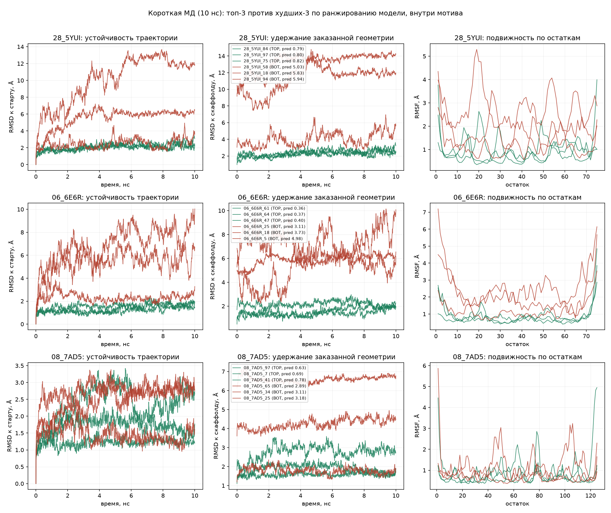

# 10 — Молекулярная динамика отобранных скаффолдов

Проверка ранжирования модели независимым от оракула способом: скаффолды RFdiffusion, отобранные и отбракованные нашей сетью, прогоняются в явном растворителе, и сравнивается их поведение. Раздел 7.5 описывал МД как стресс-тест по литературе — здесь она поставлена на наши кандидаты.

Ключевое отличие от всех метрик в docs/05 и docs/08: **МД не использует ESMFold**. Истинный scRMSD — это мнение рефолдера, то есть той же самой нейросетевой семьи, что и оцениваемые генераторы. Силовое поле не знает ни про PDB-статистику обучающей выборки, ни про предпочтения ProteinMPNN. Совпадение двух оценок — довод, что модель ловит физику, а не причуды оракула.

Дата прогона: 2026-08-15. Веса — `soft_model.pth` (переобучение 14.08 на анти-гомологичном сплите), те же, что в docs/08.

## 10.1. Отбор кандидатов

Отбор ведётся **внутри мотива**, по три лучших и три худших. Причина — тот же артефакт композиции, ради которого headline-метрика в docs/05 заменена на внутримотивную: глобальный топ-10 по потоку RFdiffusion целиком состоит из `17_7DGW`, а глобальный «низ» — из `04_5WN9`. Сравнивать их значило бы сравнивать лёгкий мотив с трудным, а заодно длину 125 против 75 — и приписывать модели то, что на деле различает задачи, а не структуры.

Конкретно: пул — 30 мотивов × ровно 100 сэмплов = 3000 скаффолдов, тот же, что в docs/08. Модель скорит все 3000 (`filter_designability.py` → `results/filter_results.csv`, поле `pred_scrmsd`). Затем внутри выбранного мотива сто сэмплов сортируются по `pred_scrmsd`, и берутся `head(3)` → TOP, `tail(3)` → BOT.

Насколько велик артефакт состава, видно по самому пулу: в глобальном топ-10 **10 из 10** сэмплов принадлежат мотиву `17_7DGW` (доля дизайнируемых 0.99, длина 125), в глобальном низ-10 — **10 из 10** мотиву `04_5WN9` (0.17, длина 75). Пуловое сравнение измеряло бы разницу задач, а не работу скорера.

**Выбор мотивов продиктован ценой счёта.** Стоимость МД растёт с числом атомов, а 75 остатков — минимальная длина в пуле; таких мотивов всего три: `04_5WN9` (доля дизайнируемых 0.17), `28_5YUI` (0.45) и `06_6E6R` (0.85). Взяты два последних — средне-трудный и лёгкий: разные уровни сложности дают проверку на воспроизводимость, и у обоих внутри мотива достаточный разброс предсказаний (0.79–5.94 и 0.36–4.98), чтобы «верх» и «низ» действительно различались. Длина 75 у всех двенадцати систем, то есть длина, задача и базовая сложность внутри каждого сравнения зафиксированы.

**Отбор слеп к разметке.** Ранжирование идёт только по `pred_scrmsd`; истинный scRMSD в отборе не участвует и приводится ниже исключительно для контроля (`md/select.py`).

## 10.2. Что именно моделируется

Скаффолды RFdiffusion содержат только остов (N, CA, C, O) с заглушками GLY — запустить МД на них нельзя, боковых цепей нет. Поэтому моделируется **ESMFold-рефолд той последовательности ProteinMPNN, которая даёт минимальный RMSD** к скаффолду, — то есть ровно та структура, которая определяет метку при `SCRMSD_AGG = "min"` (docs/07, `common/motifbench.py`).

Отсюда две разные величины RMSD, и путать их нельзя:

- **RMSD к стартовому кадру** — устоял ли рефолд сам по себе. Вклад одной динамики; стартовая ошибка в него не входит, поэтому он сравним между группами напрямую.
- **RMSD к исходному скаффолду RFdiffusion** — удержана ли заказанная геометрия. Включает начальное расхождение $t_0$, которое у отбракованных велико ещё до первого шага интегрирования.

## 10.3. Протокол

GROMACS 2026.1 + CUDA, amber99sb-ildn / TIP3P, додекаэдрический бокс с зазором 1.0 нм, 0.15 M NaCl с нейтрализацией. Минимизация (steepest descent, `emtol` 1000) → NVT 100 пс с позиционными ограничениями (V-rescale, 300 K) → NPT 100 пс (C-rescale, 1.0 бар, `refcoord_scaling = com`) → продукция **10 нс** с шагом 2 фс, LINCS на связях с водородом, PME, срез 1.0 нм. Кадры каждые 10 пс, `compressed-x-grps = Protein` — в `md.xtc` только белок.

Размер систем 14 119–44 211 атомов; на RTX 3080 в режиме `-nb gpu -pme gpu -bonded gpu -update gpu` получилось 532–1183 нс/день, 18 систем примерно за 5.2 часа.

Подготовка и счёт — скриптами (это часы GPU), весь разбор траекторий — в тетради `notebooks/04-molekulyarnaya-dinamika.ipynb`, где он сохранён вместе с выводом.

```bash
python -m md.select --motifs 28_5YUI 06_6E6R 08_7AD5 -k 3 -o md/manifest.csv
md/prepare.sh <esm.pdb> md/runs/<мотив>/<ГРУППА>_<sample>   # по каждой системе
md/produce.sh 10                                            # продукция
# дальше — notebooks/04-molekulyarnaya-dinamika.ipynb:
#   results/md_metrics.csv, figures/md_stability.png, md/runs/*/*/series.npz
```

**Снятие периодических границ обязательно.** Первый прогон анализа дал RMSD 7.8 Å со скачками до 16 Å там, где белок был устойчив: цепь разрывалась периодической границей и половина «уезжала» на вектор бокса. Признак — корректный нулевой кадр при взрывающихся последующих. Лечится `gmx trjconv -pbc whole` до всякого выравнивания (функция `whole_traj`, раздел 3 тетради).

## 10.4. Результаты



Строки рисунка — мотивы; третья строка (`08_7AD5`) относится к разделу 10.7 и в разбор ниже не входит.

| мотив | сэмпл | гр. | pred | истина | RMSD к старту | RMSD к скаффолду | $t_0$ | Rg | RMSF | доля SSE | H-связи |
|---|---|---|---:|---:|---:|---:|---:|---:|---:|---:|---:|
| `28_5YUI` | `_84` | TOP | 0.79 | 0.71 | 2.50 | 2.54 | 0.96 | 13.5 | 1.00 | 0.77 | 71.9 |
| `28_5YUI` | `_97` | TOP | 0.80 | 1.12 | 2.15 | 2.27 | 1.52 | 12.9 | 0.93 | 0.64 | 68.8 |
| `28_5YUI` | `_75` | TOP | 0.82 | 1.48 | 2.16 | 2.62 | 1.69 | 13.5 | 0.83 | 0.68 | 75.2 |
| `28_5YUI` | `_58` | BOT | 5.03 | 9.11 | 6.09 | 13.88 | 10.47 | 13.7 | 1.27 | 0.59 | 39.0 |
| `28_5YUI` | `_18` | BOT | 5.83 | 2.71 | 2.69 | 4.37 | 3.04 | 17.3 | 1.72 | 0.61 | 56.8 |
| `28_5YUI` | `_94` | BOT | 5.94 | 8.20 | 12.19 | 12.04 | 9.16 | 17.2 | 2.71 | 0.51 | 43.1 |
| `06_6E6R` | `_61` | TOP | 0.36 | 0.99 | 1.66 | 2.25 | 1.69 | 12.6 | 0.85 | 0.80 | 73.2 |
| `06_6E6R` | `_64` | TOP | 0.37 | 0.37 | 1.45 | 1.53 | 0.49 | 12.0 | 0.81 | 0.83 | 73.5 |
| `06_6E6R` | `_47` | TOP | 0.40 | 0.64 | 1.49 | 1.87 | 0.80 | 12.6 | 0.91 | 0.85 | 71.9 |
| `06_6E6R` | `_25` | BOT | 3.11 | 4.67 | 5.78 | 7.62 | 5.27 | 18.6 | 2.39 | 0.92 | 71.2 |
| `06_6E6R` | `_18` | BOT | 3.73 | 6.05 | 8.01 | 5.90 | 6.83 | 15.4 | 2.34 | 0.87 | 62.5 |
| `06_6E6R` | `_5` | BOT | 4.98 | 3.88 | 2.29 | 6.05 | 4.96 | 13.5 | 1.20 | 0.76 | 65.6 |

Все RMSD и RMSF в ангстремах, H-связи — среднее число на кадр по второй половине траектории.

Средние по группам:

| мотив | гр. | RMSD к старту | RMSD к скаффолду | Rg | RMSF | доля SSE | H-связи |
|---|---|---:|---:|---:|---:|---:|---:|
| `28_5YUI` | TOP | **2.27** | **2.48** | 13.3 | **0.92** | 0.70 | **72.0** |
| `28_5YUI` | BOT | **6.99** | **10.09** | 16.1 | **1.90** | 0.57 | **46.3** |
| `06_6E6R` | TOP | **1.54** | **1.88** | 12.4 | **0.86** | 0.83 | 72.9 |
| `06_6E6R` | BOT | **5.36** | **6.52** | 15.8 | **1.98** | 0.85 | 66.5 |

### Значимость

Дизайн — 3 против 3 в каждом из двух мотивов, поэтому применим точный стратифицированный перестановочный тест: $\binom{6}{3}^2 = 400$ раскладок, минимально достижимый односторонний $p = 1/400 = 0.0025$.

| метрика | разница TOP − BOT | $p$ | диапазоны не пересекаются |
|---|---:|---:|---|
| RMSD к скаффолду | −12.26 | **0.0025** | в обоих мотивах |
| RMSD к стартовому кадру | −8.54 | **0.0025** | в обоих мотивах |
| радиус инерции | −6.17 | **0.0025** | в обоих мотивах |
| RMSF | −2.10 | **0.0025** | в обоих мотивах |
| H-связи | +32.13 | **0.0025** | в обоих (в `06_6E6R` впритык) |
| доля остатков с RMSF > 3 Å | −0.23 | 0.0150 | нет |
| доля вторичной структуры | +0.11 | 0.1300 | только в `28_5YUI` |

Четыре метрики разделяют группы **без единого перекрытия** в обоих мотивах: худшая TOP-система лучше лучшей BOT-системы по каждой из них. При этом $p = 0.0025$ — пол этого дизайна, меньше он дать не может; это утверждение «разделение идеальное», а не «эффект огромен».

## 10.5. Наблюдения

1. **Ранжирование модели предсказывает поведение в силовом поле.** Отобранные скаффолды держатся в 1.45–2.50 Å от старта и 1.53–2.62 Å от заказанной геометрии; отбракованные разбросаны шире и в среднем много дальше — 2.29–12.19 Å от старта при средних по группам 6.99 и 5.36 Å против 2.27 и 1.54 Å. Средняя подвижность отличается вдвое-втрое (RMSF 0.86 и 0.92 против 1.98 и 1.90). Это независимое от ESMFold подтверждение: сигнал, который модель извлекает из одного остова, воспроизводится физикой.

2. **Компактность разделяет чисто — но только здесь.** Радиус инерции разделяет группы без перекрытия **внутри каждого мотива**: `06_6E6R` — 12.04–12.64 Å у TOP против 13.46–18.61 Å у BOT, `28_5YUI` — 12.88–13.51 против 13.72–17.26. Объединять мотивы в один диапазон нельзя: пулово 13.51 у TOP перекрывает 13.46 у BOT, и абсолютная шкала Rg зависит от длины цепи. Отбракованные рефолды рыхлые ещё до динамики — это видно уже на стадии сольватации: их боксы 32–44 тыс. атомов против 14–20 тыс. у отобранных при одинаковой длине цепи 75. **На отложенном мотиве этот признак не воспроизвёлся вовсе** ($\rho = 0.03$, диапазоны полностью перекрываются) — см. 10.7. Напрашивавшаяся по двум мотивам формулировка «самый чистый разделитель» оказалась артефактом выборки.

3. **Локальная структура и укладка расходятся.** В `06_6E6R` доля вторичной структуры у BOT даже выше (0.85 против 0.83), а H-связей почти столько же (66.5 против 72.9) — спирали и листы на месте, разваливается их взаимное расположение. В `28_5YUI` рушится и локальный уровень (0.57 против 0.70, H-связей 46 против 72). То есть отбраковка модели не сводится к «мало вторичной структуры»; в одном из двух мотивов этот признак не работает вовсе.

4. **«Прирост RMSD за счёт динамики» — негодная метрика.** Идея вычесть $t_0$ и оставить чистый вклад МД выглядит естественной, но у `06_6E6R_18` прирост отрицательный (−0.94 Å): структура ушла от скаффолда на 6.8 Å ещё на старте, попала в другой минимум, и дальше RMSD к скаффолду блуждает без направления. Вычитание $t_0$ осмысленно, только пока стартовая ошибка мала. Для «чистой динамики» надо брать RMSD к стартовому кадру — он разделяет группы в обоих мотивах.

5. **Согласие двух оракулов не полное, и это интересно.** Ранговая корреляция предсказания с МД внутри мотива: $\rho = 0.66\text{–}0.77$ (при $n = 6$ все $p > 0.05$ — мощности нет, приводится как направление). Для сравнения, истинный scRMSD даёт $\rho = 1.00$ и $0.89$ в `06_6E6R`, но $0.77$ и $0.60$ в `28_5YUI` — то есть в одном мотиве предсказание модели согласуется с динамикой **лучше**, чем метка оракула, на которой модель обучалась. Утверждать по $n = 6$ ничего нельзя, но гипотеза «модель видит что-то, чего один рефолд ESMFold не измеряет» получает первое подкрепление и заслуживает отдельной проверки.

6. **Самый информативный случай — `28_5YUI_18`.** Модель поставила ему худший балл в мотиве (pred 5.83), истинный scRMSD 2.71 Å — недизайнируем, но у самого порога 2 Å, и по разметке это наименее убедительная отбраковка из шести. В динамике же он однозначно BOT: Rg 17.3 против ~13.3 у TOP, RMSF 1.72 против ≤1.00, H-связей 56.8 против ≥68.8. Единичный случай, но ровно того типа, ради которого МД и ставилась.

## 10.6. Оговорки

- **Оба мотива — `in-sample`.** Из 30 мотивов пула 24 входили в дообучение и 6 отложены; у всех двенадцати систем в манифесте стоит `role = in-sample`. То есть проверено качество ранжирования на задачах, которые модель видела, — это не проверка переноса. Выкрутиться было нельзя: среди шести отложенных мотивов нет ни одного длиной 75, самые короткие — `08_7AD5`, `23_1MPY` и `17_7DGW` по 125 остатков. Причём `17_7DGW` для такого теста не годится вовсе: доля дизайнируемых 0.99, у него попросту нет «низа». Проверка на отложенном мотиве вынесена в раздел 10.7.
- **Отбор с краёв.** Сравнивались хвосты — топ-3 и худшие-3 из 100. Это измеряет способность различать крайности, а не калибровку на всём диапазоне. Разделение в середине рейтинга не проверялось.
- **12 систем, по одной реплике.** Ни одна система не считалась повторно с другой затравкой скоростей. Разброс между репликами одной структуры не измерен, поэтому нельзя сказать, какая доля разброса внутри группы — сама структура, а какая — случайность траектории.
- **10 нс — коротко.** Это масштаб, на котором ловят грубую нестабильность, а не сворачивание или разворачивание. Отсутствие развала за 10 нс не означает, что структура стабильна.
- **Не эксперимент.** Силовое поле независимо от ESMFold, но это по-прежнему вычислительная оценка. Оговорка раздела 7.6 в силе.
- **Стартовая структура — рефолд, а не сам скаффолд.** Backbone-only выход RFdiffusion не поддаётся МД напрямую. Всё сказанное относится к паре «скаффолд + лучшая последовательность ProteinMPNN», и часть различий между группами может относиться к качеству дизайна последовательности, а не остова.

## 10.7. Проверка на отложенном мотиве

Тот же протокол на `08_7AD5` — мотив из шести отложенных, модель его при дообучении не видела. Длина 125, доля дизайнируемых 0.67, 100 сэмплов, отбор те же `head(3)`/`tail(3)` по `pred_scrmsd`. Системы 17 974–30 224 атома, 6 прогонов по 10 нс за 1.8 часа.

| сэмпл | гр. | pred | истина | дизайн. | RMSD к старту | RMSD к скаффолду | $t_0$ | Rg | RMSF | доля SSE | H-связи |
|---|---|---:|---:|---|---:|---:|---:|---:|---:|---:|---:|
| `_97` | TOP | 0.63 | 0.76 | да | 1.71 | 1.87 | 1.21 | 15.3 | 0.72 | 0.63 | 112.3 |
| `_7` | TOP | 0.69 | 0.82 | да | 1.24 | 1.59 | 1.10 | 14.5 | 0.61 | 0.61 | 112.4 |
| `_41` | TOP | 0.78 | 1.26 | да | 2.46 | 2.84 | 1.81 | 14.9 | 0.99 | 0.67 | 115.4 |
| `_65` | BOT | 2.89 | **0.87** | **да** | 1.35 | 1.72 | 1.18 | 15.3 | 0.77 | 0.58 | 97.6 |
| `_34` | BOT | 3.11 | 2.57 | нет | 2.72 | 4.40 | 3.61 | 15.4 | 1.02 | 0.49 | 92.8 |
| `_25` | BOT | 3.18 | 4.16 | нет | 2.79 | 6.65 | 6.14 | 14.6 | 0.91 | 0.42 | 89.3 |
| **TOP** | | | | | **1.80** | **2.10** | | 14.9 | **0.77** | **0.64** | **113.4** |
| **BOT** | | | | | **2.29** | **4.26** | | 15.1 | **0.90** | **0.50** | **93.3** |

**Идеальное разделение не воспроизвелось.** Четыре метрики, безупречно делившие группы на обоих in-sample мотивах, здесь перекрываются:

| метрика | TOP | BOT | разделены | $p$ (20 раскладок, пол 0.05) |
|---|---|---|---|---:|
| RMSD к стартовому кадру | 1.24–2.46 | 1.35–2.79 | нет | 0.250 |
| RMSF | 0.61–0.99 | 0.77–1.02 | нет | 0.200 |
| радиус инерции | 14.48–15.27 | 14.55–15.39 | нет | 0.300 |
| RMSD к скаффолду | 1.59–2.84 | 1.72–6.65 | нет | 0.150 |
| доля вторичной структуры | 0.61–0.67 | 0.42–0.58 | **да** | **0.050** |
| H-связи | 112.3–115.4 | 89.3–97.6 | **да** | **0.050** |

**Причина перекрытия — одна система, и это настоящая ошибка модели.** `08_7AD5_65` отправлен в худшую тройку (pred 2.89), а истинный scRMSD 0.87 Å — уверенно дизайнируем. В динамике он ведёт себя как TOP по всем показателям: RMSD к скаффолду 1.72 Å, к старту 1.35 Å, RMSF 0.77. То есть МД встала на сторону разметки, а не модели: это ложный отказ, а не пропущенная моделью нестабильность. Уберите его — и оставшиеся две BOT-системы (4.40 и 6.65 Å) отделяются от TOP (1.59–2.84 Å) без перекрытия.

Это первый такой случай: на двух in-sample мотивах все шесть отбракованных были недизайнируемы и по разметке.

### Что уцелело на трёх мотивах

Стратифицированный тест по всем трём мотивам ($20^3 = 8000$ раскладок):

| метрика | $p$ | разделение по мотивам |
|---|---:|---|
| **H-связи** | **0.00013** | `28_5YUI` да · `06_6E6R` да · `08_7AD5` да |
| RMSD к скаффолду | 0.00038 | да · да · **нет** |
| RMSF | 0.00050 | да · да · **нет** |
| RMSD к стартовому кадру | 0.00187 | да · да · **нет** |
| радиус инерции | 0.00150 | да · да · **нет** |
| доля вторичной структуры | 0.01550 | да · **нет** · да |

Число внутрибелковых водородных связей — **единственная метрика, разделяющая группы во всех трёх мотивах**. Абсолютные значения несопоставимы между мотивами (112 против 72 — это 125 остатков против 75), сравнивать можно только внутри мотива, но там она работает везде. Гипотеза: плотность H-сетки измеряет качество упаковки напрямую и меньше зависит от того, каким именно способом разваливается конкретная неудачная укладка.

### Направление ошибки

По девяти отобранным системам трёх мотивов: **9 из 9 дизайнируемы** по разметке, RMSD к скаффолду 1.53–2.84 Å — ни одного промаха на топе. Среди девяти отбракованных дизайнируемым оказался один (`08_7AD5_65`).

Для префильтра это ошибка дешёвой стороны. Ложный отказ стоит пропущенного кандидата, ложное принятие — дорогой проверки ESMFold и всего, что за ней. Модель ошибается в консервативную сторону, и точность на топе, ради которой фильтр и строится, не пострадала ни разу.

### Что это меняет в выводах

Раздел 10.5 писался по двум in-sample мотивам, и два его наблюдения проверку не прошли. Компактность (наблюдение 2) не разделяет отложенный мотив вовсе ($\rho = 0.03$). Утверждение «RMSD к стартовому кадру устойчиво разделяет в обоих мотивах» (наблюдение 4) верно ровно для тех двух мотивов и не переносится на третий.

Что уцелело: ранжирование модели коррелирует с поведением в силовом поле и на невиданном мотиве ($\rho = 0.66\text{–}0.71$ для RMSD и RMSF), но эффект заметно слабее, а разделение групп держится на H-связях и доле вторичной структуры, а не на геометрических метриках. Осторожный вывод: на in-sample мотивах разделение выглядело идеальным отчасти потому, что мотивы были in-sample.

### Оговорки к этому разделу

- Один мотив, 3 против 3: $\binom{6}{3} = 20$ раскладок, минимально достижимый $p = 0.05$. Ниже перестановочный тест здесь опуститься не может физически.
- Отложенных мотивов шесть, проверен один. `23_1MPY` (доля дизайнируемых 0.72, длина 125) — очевидный следующий кандидат; `17_7DGW` непригоден, у него 0.99 дизайнируемых и попросту нет «низа».
- Остальные оговорки раздела 10.6 действуют без изменений.
